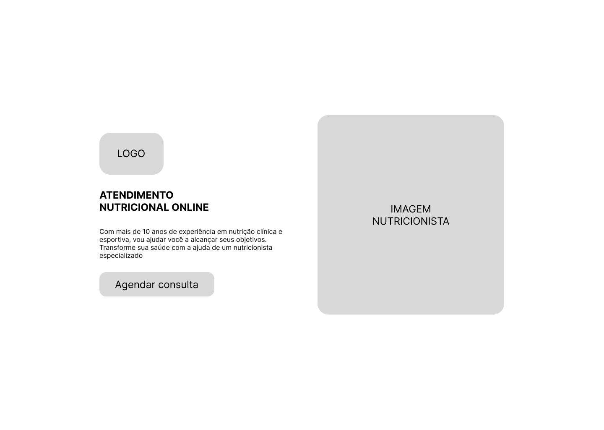
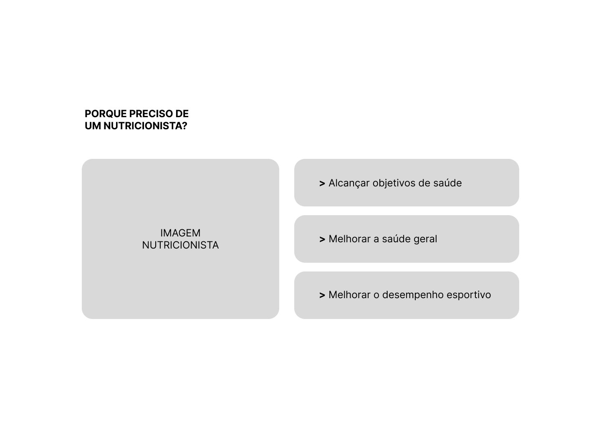
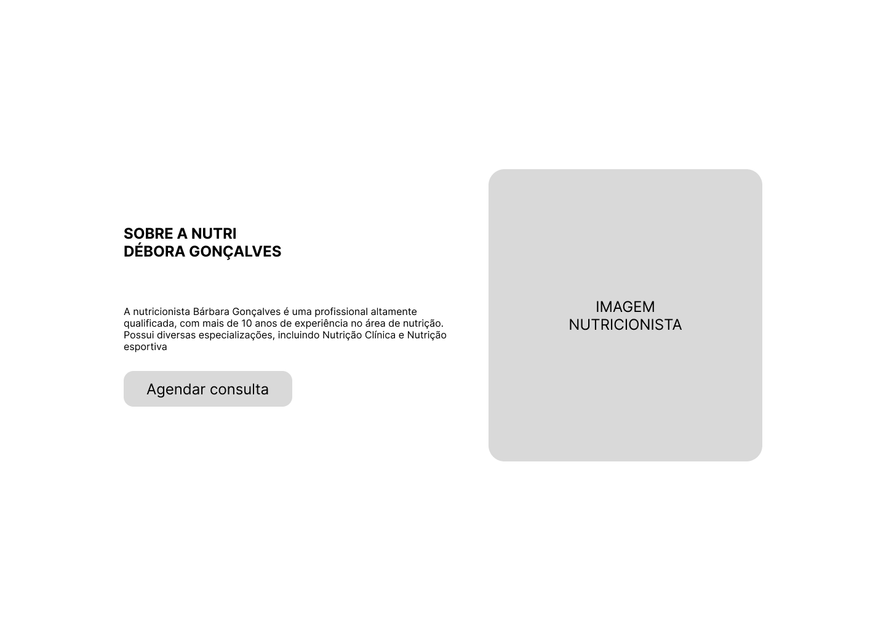
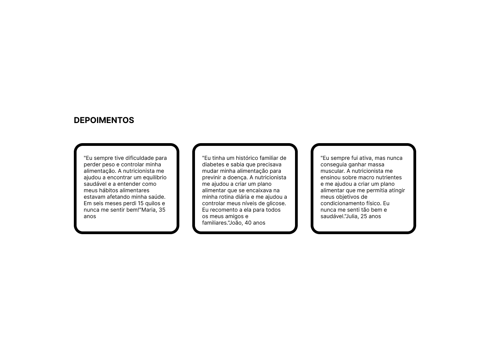
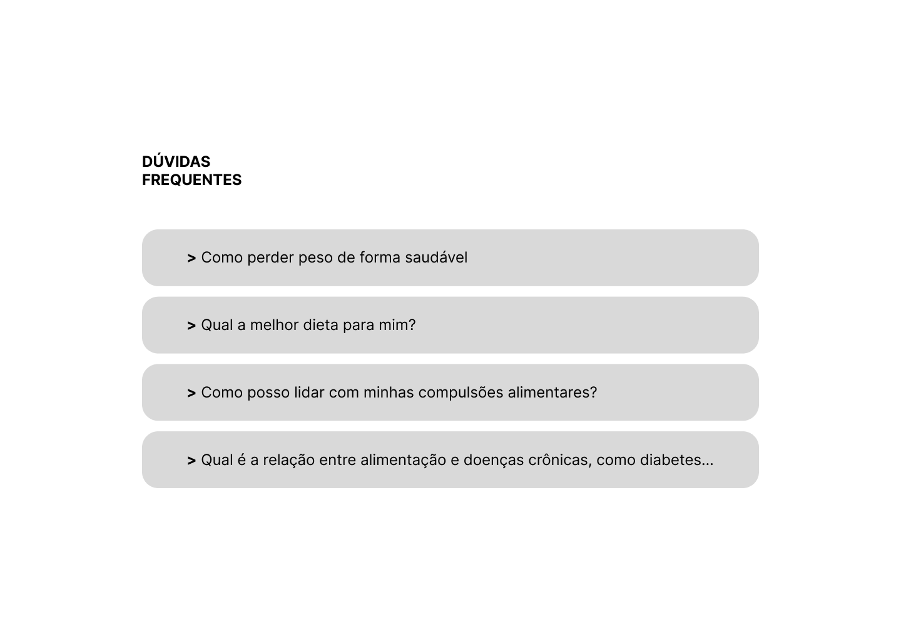
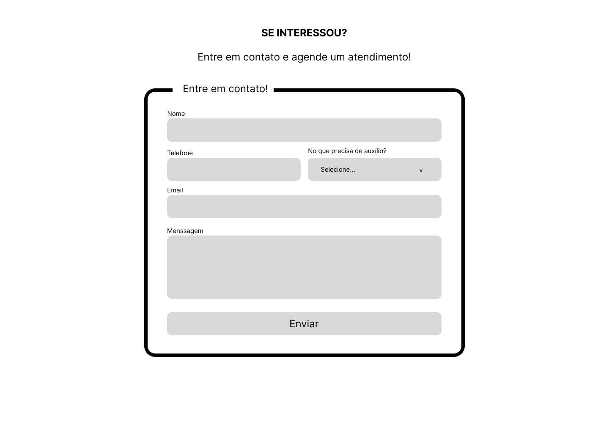

# PTI - Web Standards `By: Hállan Neves`

Este projeto consiste em um trabalho acadêmico desenvolvido como parte do currículo da disciplina de Desenvolvimento Web. A tarefa proposta envolve a criação de uma landing page responsiva para uma nutricionista especializada em tratamento de obesidade, performance física e doenças crônicas, utilizando HTML, CSS e Flexbox.

## [Veja a página em produção](https://hallan-n.github.io/pti-web-standards/)

## Atividade proposta
Desenvolver uma Landing page para um negócio pequeno

## Etapas
1. Escolha do ramo e Prototipação
    - A primeira etapa deste trabalho acadêmico consiste na seleção de um ramo de negócio de pequeno porte, como por exemplo uma nutricionista especializada em tratamento de obesidade, performance física e doenças crônicas, e na prototipação da página web que servirá como uma landing page para este profissional autônomo.
    A prototipação foi feito no [figma](https://www.figma.com/) e conta com as seguintes seções:
    1. Página Home
    
    2. Página Sobre parte 1
    
    3. Página Sobre parte 2
    
    4. Página Depoimentos
    
    5. Página Dúvidas Frequentes
    
    6. Página Formulário de contato
    

2. Codificação
    - Na segunda fase, foi implementado a página web utilizando HTML e CSS puros, aplicando técnicas de layout responsivo para garantir uma experiência consistente em diversos dispositivos. Nesse processo foi feito uma tradução do protótipo em código funcional, priorizando a adaptabilidade e a estética do design em diferentes tamanhos de tela
